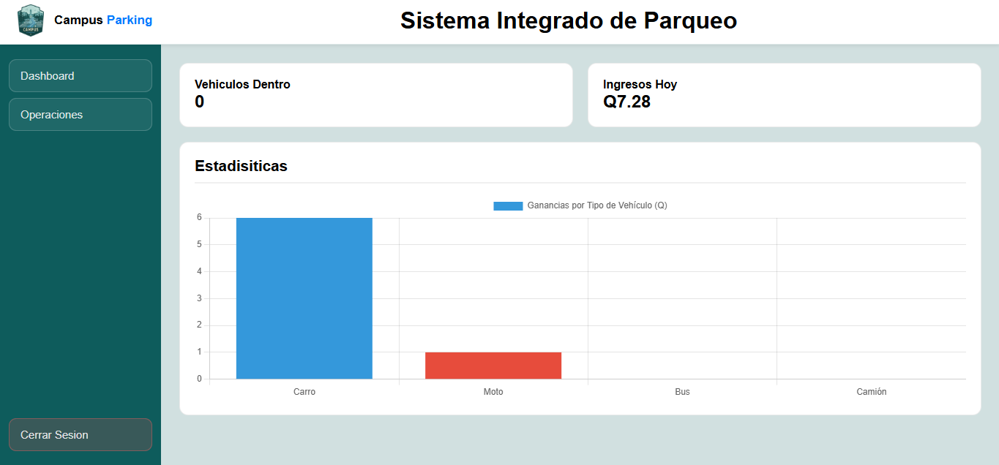

# 🚗 Campus Parking

 Esta es una página web diseñada para optimizar y administrar el control de vehículos y la disponibilidad de espacios de estacionamiento dentro de un parqueadero. El sistema cuenta con un dashboard donde podemos ver una grafica de los vehiculos que nos dejan mas ganancias y tambien sobre las ganancias que tenemos al dia.

### 📊 Dashboard 

### ⚙ Sistema de Gestion

### 📥 Tabla de Entrada Vehiculos

### 📤 Tabla de Salida Vehiculos

---

## 🚀 Características Principales

*   **Login:** Control de acceso seguro administradores.
*   **Gestión de Vehículos:** Registro, edición y eliminación de vehículos.
*   **Monitoreo de Espacios:** Panel para verificar la disponibilidad de estacionamiento.
*   **Tablas de Monitoreo:** 
    *   *Tabla de Entradas:* Registro detallado del ingreso de vehículos, especificando la fecha y la hora exacta.
    *   *Tabla de Salidas:* Control de egreso de vehículos con observaciones automatizadas que muestran el total a pagar según el tiempo transcurrido.
*   **Registro de Datos:** Almacena los datos en el localstore directo en el navegador.

---

## 🛠️ Tecnologías Utilizadas

El proyecto fue desarrollado utilizando las tecnologías:

*   **HTML:** Estructura de la aplicación.
*   **CSS:** Diseño de la pagina.
*   **JavaScript:** Lógica del negocio, manipulación dinámica del DOM.
*   **Web (localStorage):** Para almacenar los datos directamente en el navegador.
*   **Git y GitHub:** Para guardar las versiones de la pagina web

---

## 👨🏻‍💻 Creador
**Jose Luis  Tot** 
